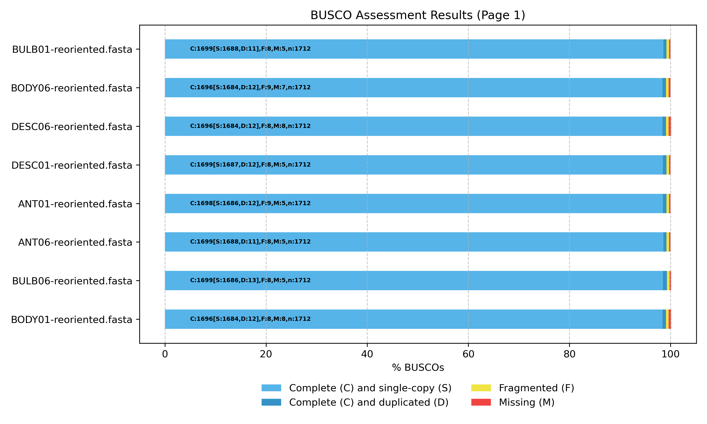
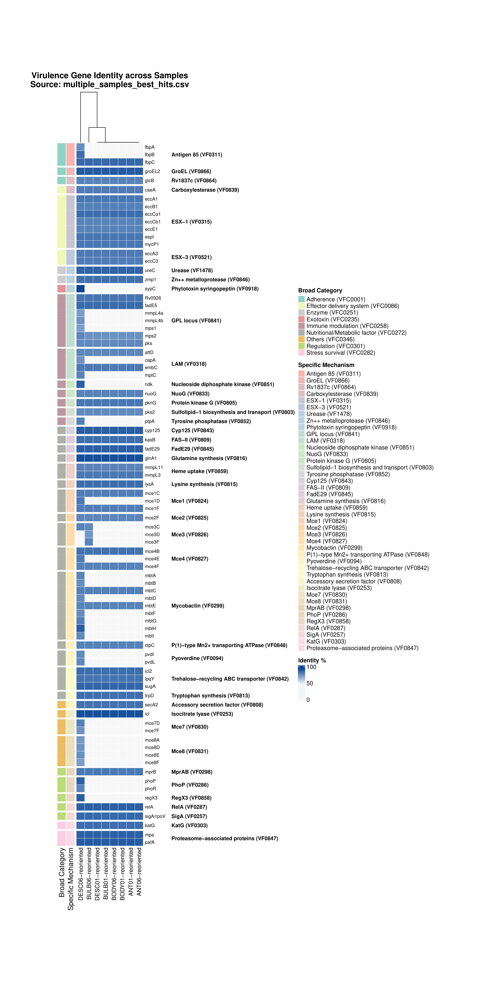
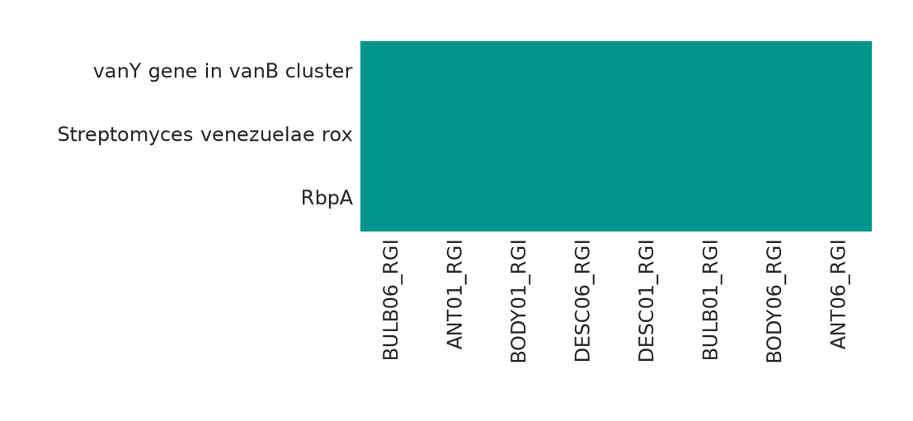

# Materials and Methods

## *De Novo* Assembly and Polishing

### Long-Read *De Novo* Assembly and Consensus Generation
Genomic DNA from eight *Mycolicibacterium cosmeticum* isolates (ANT01, ANT06, BODY01, BODY06, BULB01, BULB06, DESC01, and DESC06) was sequenced using Oxford Nanopore Technologies (ONT) MinION platform [insert flow cell/sequencing platform details, e.g., MinION/GridION, sequencing chemistry].
Prior to loading into the MinION flow cell, the gDNAs are prepared into a sequencing library using .... kit. Raw long-read quality assessment and read filtering were conducted using [what QC tool is used? NanoPlot?? The filtering thresholds??, mention the tool and filtering thresholds]. 

Long-read *de novo* assembly and consensus generation were performed using the Trycycler pipeline (which version??) [Wick et al., 2021]. Read sets were subsampled into independent subsets and assembled using [mention the assemblers used to feed into Trycycler, along with versions and run parameters]. The resulting contigs were clustered, reconciled, circularized, and partitioned into high-confidence consensus sequences in accordance with the standard Trycycler workflow.

### Short-Read Polishing and Genome Reorientation
To correct residual indel and substitution errors in the long-read consensus assemblies, a two-step short-read polishing pipeline was applied using paired-end Illumina reads, following best-practice polishing recommendations outlined by Ryan Wick (https://rrwick.github.io/2024/06/11/short-read-depth.html) and George Bouras (https://github.com/gbouras13/pypolca). First, paired-end short reads were aligned to the draft Trycycler assemblies using BWA-MEM (v0.7.19-r1273) with the `-a` flag enabled to preserve all alignments in repeat regions. Alignments were filtered with Polypolish `filter` (v0.7.1) and polished using Polypolish `polish` (v0.7.1) with default parameters (`--fraction_invalid 0.2`, `--fraction_valid 0.5`, `--max_errors 10`, `--min_depth 5`) to repair errors across both unique and repetitive sequences. The Polypolish-corrected assemblies were subsequently polished using Pypolca (v0.4.0) in careful mode (`pypolca run --careful`) to fix remaining base inaccuracies. Finally, complete circularized chromosomes and extrachromosomal elements were reoriented using dnaapler (v1.3.0) via `dnaapler all` (`--autocomplete nearest`, `-e 1e-10`), reorienting chromosomal contigs to start at the *dnaA* gene, while extrachromosomal contigs were reoriented to start at either *repA* or *terL* gene.

## Taxonomic Identification and Genome Annotation

### Taxonomic Identification
Species-level taxonomic affiliation of all eight previously suspected to be *Mycolicibacterium peregrinum* isolates was determined using a triage approach of 16S rRNA ID, GTDB-Tk pipeline,and TYGS webserver. Full-length 16S rRNA gene sequences were extracted from the Bakta-annotated genome assemblies and queried against the NCBI nt database using BLASTn. Genome-scale taxonomic classification and Average Nucleotide Identity (ANI) comparisons were performed using GTDB-Tk's `classify_wf` pipeline (v2.7.2) against the Genome Taxonomy Database (GTDB release r232) [Chaumeil et al., 2022], utilizing skani (v0.3.1) and pplacer for tree placement and reference ANI verification. High-resolution digital DNA–DNA hybridization (dDDH) and whole-genome phylogenetic analyses were performed using the Type (Strain) Genome Server (TYGS; https://tygs.dsmz.de) [Meier-Kolthoff & Göker, 2019]. Digital DDH values were calculated using the Genome BLAST Distance Phylogeny (GBDP) formulas ($d_0$, $d_4$, and $d_6$) against closely related type strains.

The GTDB-Tk and TYGS results were concordant: all eight isolates had the same closest GTDB-Tk reference (GCF_000613185.1) and the same closest TYGS type strain, *Mycobacterium cosmeticum* DSM 44829 (TYGS ID 3161), with d4 dDDH values of 87.0% for seven isolates and 86.9% for BODY06 (Table 2). These results support species-level assignment to the *Mycolicibacterium cosmeticum* lineage, while the assembly-size and contiguity differences in Table 1 indicate that the isolates should not be described as sequence-identical.

### Genome Quality Assessment and Structural Annotation
Assembly completeness and contamination were evaluated using CheckM2 (v1.1.0) [Chklovski et al., 2023] and BUSCO (v[insert version]) against the `mycolicibacterium_odb12` lineage dataset [Manni et al., 2021]. Comprehensive structural and functional genome annotation was performed using Bakta (v1.12.0) [Schwengers et al., 2021] with the full database (v6.0), identifying coding sequences (CDSs), ribosomal RNAs (rRNAs), transfer RNAs (tRNAs), non-coding RNAs (ncRNAs), and CRISPR arrays.

## Virulence and Antimicrobial Resistance Determinant Profiling
### Virulence Factor Profiling
Putative virulence factors were screened across all eight *M. cosmeticum* genome assemblies using the VF classifier pipeline with default parameters (https://github.com/GenomicaMicrob/VF_classifier) against the Virulence Factor Database (VFDB; http://www.mgc.ac.cn/VFs/) [Liu et al., 2022]. Predicted virulence determinants were categorized into functional classes, some of them including adherence, effector delivery systems (Type VII secretion), enzymes, exotoxins, immune modulation, nutritional/metabolic factors, regulation, stress survival, and others based on sequence similarity and conserved domain architecture.
### Antimicrobial Resistance (AMR) Gene Profiling
Antimicrobial resistance genes were identified using the Resistance Gene Identifier (RGI v6.0.8) against the Comprehensive Antibiotic Resistance Database (CARD Canonical v4.0.1, CARD Variants v4.0.2) [Alcock et al., 2023]. Open reading frames (ORFs) were predicted using Pyrodigal and aligned using DIAMOND against curated CARD reference protein models. Only Strict hits were retained for resistome characterization, while Loose and Nudged predictions were excluded.

### Plasmid and Mobilome Analysis
Extrachromosomal replicons and mobile genetic elements (MGEs) were characterized using several tools. Contig circularity was initially determined during Trycycler consensus assembly [Wick et al., 2021], and contigs were reoriented using dnaapler (v1.3.0) [Bouras et al., 2024], which identified replication initiation (*repA*) and large terminase (*terL*) genes on non-chromosomal contigs. Replicon typing, relaxase classification, and mobility prediction were performed using MOB-suite (v3.1.9) `mob_recon` with `--run_overhang`, `--keep_tmp`, and `--debug` flags [Robertson & Nash, 2018]. As an independent confirmation of replicon identity, plasmid and virus/provirus classification was performed using geNomad (v1.12.0) `end-to-end` with default scoring thresholds (plasmid/virus score ≥ 0.7) against the geNomad database [Camargo et al., 2024]. Insertion sequences (ISs) were identified from the MOB-suite MGE report.

## Comparative Pangenome Analysis

Comparative pangenome analysis was performed with Panaroo v1.8.0 [Tonkin-Hill et al., 2020]. The dataset included the eight isolates generated in this study and seven publicly available *M. cosmeticum* assemblies selected from the NCBI Genome Datasets: GCF_000613185.1, GCF_005670675.1, GCF_039668325.1, GCF_039668265.1, GCA_016197365.1, GCA_000455185.1, and GCA_000987455.1. All 15 assemblies were annotated with Bakta v1.12.0 using the full database v6.0. To provide the Prokka-style combined GFF format expected by Panaroo, each Bakta GFF3 file was paired with its corresponding genome FASTA and converted using `convert_bakta_to_prokka_gff.py`. Sequence identifiers were checked before conversion, and all 96,848 CDS features were retained across the converted inputs.

Panaroo was run in strict cleaning mode with invalid-gene removal enabled (`--clean-mode strict --remove-invalid-genes`). A core-gene alignment was generated with MAFFT [Katoh & Standley, 2013] (`-a core --aligner mafft`), defining core gene families as those present in at least 95% of the genomes (`--core_threshold 0.95`), 32 threads used, then with all remaining parameters left at their defaults. The resulting gene presence/absence matrices and core-gene alignment were retained for downstream comparative analysis.

# Results and Discussion

**Table 1.** Assembly, structural annotation, and quality statistics for the eight *Mycolicibacterium cosmeticum* isolates. Genome coverage was recalculated as the total number of bases in the paired-end short-read statistics divided by the corresponding assembled genome length. GC content and annotation counts were recalculated from the Bakta GenBank records. Completeness and contamination scores were estimated using CheckM2 (general model).

| Isolate ID | Length (bp) | Genome Coverage (Short Reads) | GC Content (%) | CDSs | rRNAs | tRNAs | oriVs & oriTs | Number of Contigs | Completeness/Contamination (%) |
| :--- | ---: | ---: | ---: | ---: | ---: | ---: | :---: | ---: | :---: |
| ANT01 | 6,569,180 | 22.58× | 68.22 | 6,369 | 6 | 47 | 0 / 0 | 2 | 99.39 / 0.43 |
| ANT06 | 6,546,594 | 22.51× | 68.23 | 6,334 | 6 | 47 | 0 / 0 | 2 | 99.39 / 0.42 |
| BODY01 | 6,555,275 | 21.28× | 68.22 | 6,349 | 6 | 47 | 0 / 0 | 2 | 99.39 / 0.41 |
| BODY06 | 6,539,653 | 25.44× | 68.23 | 6,342 | 6 | 47 | 0 / 0 | 3 | 99.33 / 0.42 |
| BULB01 | 6,562,567 | 15.44× | 68.22 | 6,361 | 6 | 47 | 0 / 0 | 2 | 99.39 / 0.41 |
| BULB06 | 6,733,065 | 31.85× | 68.13 | 6,529 | 6 | 47 | 0 / 0 | 4 | 99.39 / 0.42 |
| DESC01 | 6,568,969 | 13.11× | 68.22 | 6,368 | 6 | 47 | 0 / 0 | 2 | 99.39 / 0.43 |
| DESC06 | 6,554,122 | 12.57× | 68.22 | 6,346 | 6 | 47 | 0 / 0 | 5 | 99.39 / 0.41 |

Across the eight *Mycolicibacterium cosmeticum* isolates, the hybrid assemblies revealed a highly conserved genomic architecture with total genome sizes ranging from 6.54 to 6.73 Mbp and high, uniform GC contents of 68.13%–68.23% (Table 1). Annotation identified 6,334 to 6,529 protein-coding sequences alongside strictly conserved RNA complements (6 rRNAs and 47 tRNAs) across all isolates. The assemblies achieved high contiguity (2–5 contigs), with five isolates resolved into a single closed chromosome (~6.33 Mbp) and one large plasmid-like contig (~212-241 kbp). Notably, in DESC06 (5 contigs), the chromosome was partitioned across a ~5.25 Mbp primary segment (reoriented to *dnaA*) and a ~1.07 Mbp secondary segment. Evidence from running TYGS evaluation on the secondary segment confirmed it as a fragmented chromosomal region rather than an unrelated replicon, yielding a d4 dDDH value of 84.6% (CI: 81.8%–87.0%) against *M. cosmeticum* DSM 44829, with their combined length (5.25 + 1.07 ≈ 6.32 Mbp) aligning with the intact ~6.33 Mbp chromosomes of the other isolates. This chromosomal attribution was also supported by geNomad classification, which identified the three smaller contigs in DESC06 (7.5–162.8 kbp) as plasmids (scores 0.87–0.99) while excluding the 1.07 Mbp fragment from plasmid designation, detecting only a localized proviral remnant (6.1 kbp). Supported by short-read polishing coverages ranging from 12.57× to 31.85×, all assemblies are deemed of high quality with CheckM2 general completeness exceeding 99.3% and negligible contamination (0.41%–0.43%), establishing high-confidence complete genomes for downstream comparative analysis.

**Table 2.** GTDB-Tk and TYGS taxonomic summary for the eight isolates. The d4 dDDH column reports the maximum d4 value in each isolate's TYGS pairwise comparison, and the closest strain ID is the TYGS deposit identifier.

| Isolate ID | Closest Genome Reference | ANI (%) | AF | Closest Placement Radius | MSA (%) | d4 dDDH (%) | Closest Strain ID |
| --- | --- | ---: | ---: | ---: | ---: | ---: | --- |
| ANT01 | GCF_000613185.1 | 98.57 | 0.915 | 95.0 | 96.37 | 87.0 | DSM 44829 |
| ANT06 | GCF_000613185.1 | 98.57 | 0.915 | 95.0 | 96.37 | 87.0 | DSM 44829 |
| BODY01 | GCF_000613185.1 | 98.57 | 0.915 | 95.0 | 96.37 | 87.0 | DSM 44829 |
| BODY06 | GCF_000613185.1 | 98.57 | 0.915 | 95.0 | 96.37 | 86.9 | DSM 44829 |
| BULB01 | GCF_000613185.1 | 98.57 | 0.915 | 95.0 | 96.37 | 87.0 | DSM 44829 |
| BULB06 | GCF_000613185.1 | 98.57 | 0.915 | 95.0 | 96.37 | 87.0 | DSM 44829 |
| DESC01 | GCF_000613185.1 | 98.57 | 0.915 | 95.0 | 96.37 | 87.0 | DSM 44829 |
| DESC06 | GCF_000613185.1 | 98.57 | 0.913 | 95.0 | 96.37 | 87.0 | DSM 44829 |

Phylogenomic classification via GTDB-Tk and TYGS unambiguously confirmed all eight isolates as *Mycolicibacterium cosmeticum*, sharing 98.57% ANI with reference genome GCF_000613185.1 across high marker alignment coverage (96.37% MSA).

Genome assembly completeness was assessed using BUSCO v5 against the lineage-specific `mycolicibacterium_odb12` dataset comprising 1,712 single-copy orthologs (Figure 1). All eight *Mycolicibacterium cosmeticum* assemblies exhibited near-complete gene recovery, with total completeness values exceeding 99.0% (ANT06, BULB01, BULB06, and DESC01 at 99.24%; ANT01 at 99.18%; BODY01, BODY06, and DESC06 at 99.07%). The vast majority of benchmark genes were identified in single copy (1,684–1,688 genes; 98.4%–98.6%), while duplicated (0.6%–0.8%), fragmented (~0.5%), and missing (<0.5%) orthologs remained negligible across all isolates, validating the structural integrity of the polished genomes. Complementing the BUSCO benchmarks, genome quality assessment with CheckM2 demonstrated near-perfect completeness and high purity across all eight isolates, with lineage-specific completeness reaching 100.0% (99.33%–99.39% general completeness) and exceptionally low contamination rates (0.41%–0.43%), alongside consistent coding densities of 92.4%–92.7%.

**Figure 1.** BUSCO completeness profiles of the eight *Mycolicibacterium cosmeticum* genome assemblies based on the `mycolicibacterium_odb12` lineage dataset (n = 1,712 orthologs). Stacked bars show the proportions of complete single-copy (S), complete duplicated (D), fragmented (F), and missing (M) BUSCOs; labels within each bar report the corresponding gene counts.

## Virulence Factor Profiling

Putative virulence factors across all eight *Mycolicibacterium cosmeticum* genomes were identified using the VFanalyzer automated pipeline against the Virulence Factor Database (VFDB; http://www.mgc.ac.cn/VFs/) [Liu et al., 2022]. Predicted virulence determinants were classified into nine VFDB functional categories: adherence, effector delivery systems, enzymes, exotoxins, immune modulation, nutritional/metabolic factors, regulation, stress survival, and others based on sequence similarity and conserved domain architecture.

A conserved core of 53 virulence-associated genes (75–93% amino acid identity to VFDB reference sequences) was detected across all eight isolates and spanned seven of the nine categories. Adherence factors included antigen 85 complex component *fbpC* (85.8% identity), the chaperonin *groEL2* (89.3%), and malate synthase *glcB* (78.8%). The effector delivery system category comprised Type VII secretion components of ESX-1 (*eccA1*, *eccB1*, *eccCa1*, *eccCb1*, *eccE1*, *espI*, *mycP1*; 78.7–84.2%) and ESX-3 (*eccA3*, *eccC3*; 80.2–81.0%), along with the carboxylesterase *caeA* (80.5%). Conserved enzymes included urease *ureC* (87.1%) and the zinc metalloprotease *zmp1* (83.5%). Immune modulation determinants encompassed glycopeptidolipid (GPL) biosynthesis loci (*fadE5*, *mps2*, *pks*, *Rv0926*; 75.0–85.1%), lipoarabinomannan (LAM) elongation genes (*aftD*, *embC*; 77.8–80.8%), the NADH dehydrogenase subunit *nuoG* (78.6%), protein kinase G *pknG* (81.8%), and sulfolipid-1 biosynthesis factor *pks2* (76.7%). Nutritional and metabolic factors constituted the largest core category and included mammalian cell entry (MCE) transporters of the Mce1 (*mce1C*, *mce1F*; 79.7–79.9%), Mce2 (*mce2F*; 77.7%), and Mce4 (*mce4B*, *mce4F*; 79.1–83.2%) operons; mycobactin siderophore biosynthesis genes (*mbtC*, *mbtE*; 78.4–79.5%); cholesterol catabolism enzyme *cyp125* (88.7%); fatty acid synthase II component *kasB* (83.7%); acyl-CoA dehydrogenase *fadE29* (88.1%); glutamine synthetase *glnA1* (92.6%); heme uptake transporters (*mmpL3*, *mmpL11*; 78.4–81.3%); lysine biosynthesis enzyme *lysA* (84.2%); the P-type Mn²⁺ ATPase *ctpC* (79.1%); trehalose-recycling ABC transporter components (*icl2*, *lpqY*, *sugA*; 82.8–86.5%); and tryptophan biosynthesis enzyme *trpD* (84.0%). Additional conserved factors included the accessory SecA2 secretion factor (83.1%), isocitrate lyase *icl* (92.5%), the MprAB two-component regulator *mprB* (81.2%), the stringent response mediator *relA* (87.7%), the primary sigma factor *sigA/rpoV* (85.8%), catalase-peroxidase *katG* (84.4%), and proteasome-associated factors *mpa* and *pafA* (88.0–89.8%).

Strain-level variation was confined to two isolates and involved gains of accessory virulence loci rather than loss of the shared core. BULB06 uniquely harbored three Mce3 operon genes (*mce3C*, *mce3D*, *mce3F*; 73.2–78.3% identity) absent from the other seven genomes. DESC06 exhibited the most divergent virulence factor profile, with 34 of its 87 total VF gene hits mapping to a ~1.07 Mbp contig (cluster_002_consensus) that Trycycler assembled separately from the ~5.25 Mbp main chromosome. Several lines of evidence indicate that this contig represents a displaced chromosomal segment rather than a foreign replicon: (i) six conserved core genes (*mbtC*, *mbtE*, *glnA1*, *kasB*, *caeA*, *trpD*) that reside on the main chromosome in all other isolates were relocated to this fragment in DESC06; (ii) TYGS analysis of the isolated fragment yielded a d4 digital DNA–DNA hybridization value of 84.6% (CI: 81.8–87.0%) against *M. cosmeticum* DSM 44829, confirming same-species origin; and (iii) the combined size of the two contigs (5.25 + 1.07 ≈ 6.32 Mbp) is consistent with the chromosome sizes of the other isolates (6.33–6.57 Mbp). Beyond the displaced core genes, DESC06 carried genuinely unique virulence determinants on cluster_002, organized into two principal genomic regions: an extended mycobactin siderophore biosynthesis cluster at ~250–275 kb (*mbtA*, *mbtB*, *mbtD*, *mbtF*, *mbtG*, *mbtH*, *mbtI*; 75.8–89.1% identity) whose nonribosomal peptide synthetase (NRPS) domains also generated cross-hits to *sypC*, *pvdI*, and *pvdL* in VFDB, and a distal region at ~800–915 kb harboring adherence gene paralogs (*fbpA*, *fbpB*; 76.1–76.2%), GPL locus genes (*mmpL4b*, *mps1*; 71.7–73.5%), and Mce7/Mce8 family transporters (*mce7D*, *mce7F*, *mce8A*, *mce8D*, *mce8E*, *mce8F*; 71.9–79.0%). Additional DESC06-unique determinants residing on the main chromosome included immune modulators (*ndk*, 87.7%; *ptpA*, 79.2%), LAM biosynthesis genes (*capA*, 74.0%; *mptC*, 78.4%), GPL transporter *mmpL4a* (70.8%), supplementary MCE components (*mce1D*, 81.1%; *mce3C*, 78.7%; *mce4E*, 80.6%), and two-component regulatory systems PhoP–PhoR (78.4–88.2%) and RegX3 (88.6%). The expanded virulence repertoire of DESC06, concentrated on a chromosomal segment that failed to reconcile during assembly, likely reflects a large-scale structural rearrangement or insertion in this isolate relative to the other seven genomes.

**Figure 2.** Comparative heatmap of predicted virulence factors and their percentage sequence identities across the eight *Mycolicibacterium cosmeticum* isolates based on VFDB screening. Rows represent individual virulence genes grouped by functional category, and columns represent the eight genome assemblies. Color intensity indicates the percentage amino acid identity to the closest VFDB reference homolog; white cells denote absence (0% identity).

## Antimicrobial Resistance Gene Profiling

All eight *Mycolicibacterium cosmeticum* isolates returned an identical and minimal AMR gene complement of three Strict hits (Figure 3). Two genes conferred predicted resistance to rifamycin antibiotics through distinct mechanisms: the RNA polymerase-binding protein *rbpA* (93.75% amino acid identity; antibiotic target protection) and the rifampin monooxygenase *rox*, homologous to *Streptomyces venezuelae* Rox (67.3% identity; antibiotic inactivation). RbpA is a broadly conserved actinobacterial transcription factor that enhances RNA polymerase activity and reduces rifamycin susceptibility, while Rox catalyzes oxidative inactivation of rifampin. The third determinant, a *vanY* homolog in the *vanB* gene cluster (32.77% identity), encodes a predicted D,D-carboxypeptidase associated with glycopeptide (vancomycin) resistance through antibiotic target alteration. The low sequence identity of the *vanY* hit suggests a distantly related homolog rather than a recently acquired resistance cassette. No strain-level variation was observed in the AMR gene repertoire as all eight isolates carried exactly the same three determinants at identical sequence identities, consistent with the highly conserved core genome observed across the panel.

**Figure 3.** Heatmap of antimicrobial resistance genes identified across the eight *Mycolicibacterium cosmeticum* isolates by RGI/CARD Strict-hit screening. All isolates share an identical complement of three resistance determinants: *vanY* (glycopeptide resistance), *rox* (rifamycin inactivation), and *rbpA* (rifamycin target protection).

## Plasmid-Like Contigs and Mobilome Dynamics

Beyond the main chromosome, all eight *M. cosmeticum* isolates carried between one and four additional plasmid-like contigs resolved by Trycycler (Table 3). Several independent piece of evidence support a plausible plasmid identity for these contigs: (i) dnaapler reoriented them to a replication initiation protein gene (*repA*); (ii) their GC content (64.0%–65.3%) was consistently ~3% lower than that of the respective chromosomes (~68.3%); and (iii) geNomad classified 12 contigs as a plasmid with high confidence (scores 0.87–0.99) from its aggregate and marker classifiers, except the one weak-discordant call of DESC06 cluster_005 . MOB-suite `mob_recon`, however, assigned all contigs including these putative plasmids to the `chromosome` bin, and did not detect replicon, relaxase, or oriT biomarkers in seven of the eight isolates; the sole exception was BULB06 cluster_002 (191.2 kbp), for which MOB-suite identified a replicon match to `rep_cluster_1561` (NCBI accession CP015221; 99.88% identity and 100% coverage). Nevertheless, MOB-suite `mob_typer` found no recognized mobility profile, so transferability cannot be inferred. This stark contrast with geNomad results likely reflects the limited representation of mycobacterial plasmids in MOB-suite's reference databases.

Five isolates (ANT01, ANT06, BODY01, BULB01, and DESC01) each contained one large plasmid-like candidate of 212-241 kbp and 65.1%-65.2% GC. BODY06 and BULB06 contained related 153 kbp and 56 kbp plasmid-like candidates along with an additional plasmid-like contig for BULB06 sized 191.2 kbp. In DESC06, aside from the ~1.07 Mbp displaced chromosomal fragment discussed before, three additional contigs were classified as putative plasmids by geNomad: a 162.8 kbp element (score 0.989, reoriented to *terL* by dnaapler), a 62.1 kbp *repA*-bearing replicon (score 0.989), and a 7.5 kbp element (score 0.868). geNomad additionally identified a conserved Caudoviricetes provirus (~10.9 kbp; virus score 0.945; 5 hallmark genes) integrated into the main chromosome at a syntenic position across seven of the eight isolates (~1.94 Mbp on cluster_001). In DESC06, a shorter proviral remnant (6.1 kbp; virus score 0.965) was detected at the start of the displaced cluster_002 segment rather than on the main chromosome, consistent with how the chromosome of this genome was split into two. MOB-suite MGE screening identified IS1511 (IS256 family) insertion sequences exclusively on the main chromosomes, with 4 copies in most isolates and 3 in DESC06 (on its shorter cluster_001). No IS elements were detected on any of the extrachromosomal contigs.

**Table 3.** Contig-level classification of all non-chromosomal elements across the eight *M. cosmeticum* isolates. mob_recon classification, dnaapler reorientation gene, and geNomad plasmid/provirus scores are shown for each contig. The main chromosomes (cluster_001, reoriented to *dnaA*) are omitted for brevity.

| Isolate | Contig | Size (bp) | GC (%) | mob_recon class | rep_type | dnaapler gene | geNomad finding |
| :--- | :--- | ---: | ---: | :--- | :--- | :--- | :--- |
| ANT01 | cluster_002 | 241,330 | 65.15 | chromosome | – | *repA*-like | Plasmid-like (0.989; 1 hallmark) |
| ANT06 | cluster_003 | 212,343 | 65.12 | chromosome | – | *repA*-like | Plasmid-like (0.988; 1 hallmark) |
| BODY01 | cluster_002 | 233,501 | 65.10 | chromosome | – | *repA*-like | Plasmid-like (0.989; 1 hallmark) |
| BODY06 | cluster_002 | 153,339 | 65.10 | chromosome | – | *repA*-like | Plasmid-like (0.989; 0 hallmarks) |
| BODY06 | cluster_003 | 56,425 | 65.25 | chromosome | – | autocomplete | Plasmid-like (0.982; 1 hallmark) |
| BULB01 | cluster_002 | 234,995 | 65.12 | chromosome | – | *repA*-like | Plasmid-like (0.988; 1 hallmark) |
| BULB06 | cluster_002 | 191,200 | 64.82 | chromosome | rep_cluster_1561* | autocomplete | Plasmid-like (0.989; 2 hallmarks) |
| BULB06 | cluster_005 | 153,343 | 65.10 | chromosome | – | *repA*-like | Plasmid-like (0.989; 0 hallmarks) |
| BULB06 | cluster_007 | 56,704 | 65.20 | chromosome | – | autocomplete | Plasmid-like (0.982; 1 hallmark) |
| DESC01 | cluster_002 | 241,128 | 65.16 | chromosome | – | *repA*-like | Plasmid-like (0.988; 1 hallmark) |
| DESC06 | cluster_002† | 1,069,271 | 67.93 | chromosome | – | *terL* | Provirus at 1–6,117 bp (0.965) |
| DESC06 | cluster_003 | 162,770 | 65.31 | chromosome | – | *terL*-like | Plasmid-like (0.989; 1 hallmark) |
| DESC06 | cluster_004 | 62,124 | 64.68 | chromosome | – | *repA*-like | Plasmid-like (0.989; 0 hallmarks) |
| DESC06 | cluster_005 | 7,487 | 64.04 | chromosome | – | autocomplete | Provisional plasmid-like (aggregate 0.868; marker 0.381) |

†Displaced chromosomal segment; not plasmid (see Virulence Factor Profiling section).

## Comparative Pangenome Analysis

Across the 15-genome dataset, Panaroo identified 10,087 gene families, of which 1,466 (14.5%) were present in all genomes. However, this small apparent core was largely driven by the divergent public assembly GCA_016197365.1: 3,829 families occurred in every other genome but were absent from this assembly, and excluding it increased the universal core to 5,295 of 9,149 families (57.9%). GCA_016197365.1 also showed low gene-content similarity to the remaining genomes and retained only 2,458 of its 5,271 input CDS assignments after strict graph cleaning. The 15-genome result therefore should not be interpreted as evidence of an extremely open *M. cosmeticum* pangenome until the taxonomic placement and assembly quality of this accession have been independently verified.

In contrast, the eight isolates generated in this study formed a highly conserved gene-content group: 6,299 of 6,397 families (98.5%) were shared by all eight, leaving only 98 variable families, and pairwise gene-content Jaccard similarities ranged from approximately 0.988 to 0.9995. A further 472 families were shared by the eight study isolates but absent from the public genomes, with many occurring in contiguous blocks, including 201 families on the large plasmid-like contig of ANT01 and homologous regions in the other study isolates. Strict cleaning also removed all 190 CDSs from the distinct BULB06 plasmid-like contig despite its coherent replication, conjugation, Type VII secretion, mercury-resistance, and mobile-element annotations. Thus, the strict pangenome matrix captures the close relatedness of the study isolates but likely underestimates their mobile accessory gene content.

# References
1. **Trycycler**: Wick, R. R., Judd, L. M., Cerdeira, L. T., Hawkey, J., Méric, G., Vezina, B., Wyres, K. L., & Holt, K. E. (2021). Trycycler: consensus assembly of bacterial genomes from multiple long-read assemblies. *Genome Biology*, 22(1), 256. https://doi.org/10.1186/s13059-021-02483-3
2. **BWA-MEM**: Li, H. (2013). Aligning sequence reads, clone sequences and assembly contigs with BWA-MEM. *arXiv preprint*, arXiv:1303.3997. https://doi.org/10.48550/arXiv.1303.3997
3. **Polypolish**: Wick, R. R., & Holt, K. E. (2022). Polypolish: Short-read polishing of long-read bacterial genome assemblies. *PLOS Computational Biology*, 18(1), e1009804. https://doi.org/10.1371/journal.pcbi.1009804
4. **Pypolca / POLCA**: 
   - Bouras, G. (2024). *pypolca: Standalone Python implementation of the POLCA polisher from MaSuRCA* (v0.4.0). GitHub. https://github.com/gbouras13/pypolca
   - Zimin, A. V., & Salzberg, S. L. (2020). POLCA: rapid and accurate error correction for genome assemblies. *Bioinformatics*, 36(9), 2877–2879. https://doi.org/10.1093/bioinformatics/btaa080
5. **Dnaapler**: Bouras, G., Mallawaarachchi, S., Papudeshi, B., Roach, M. J., & Edwards, R. A. (2024). Dnaapler: reorienting microbial genomes to a designated starting gene. *Microbial Genomics*, 10(11), 001306. https://doi.org/10.1099/mgen.0.001306
6. **Short-Read Depth Recommendation**: Wick, R. R. (2024). *How much short-read depth do you need for hybrid polishing?* Ryan Wick's Bioinformatics Blog. https://rrwick.github.io/2024/06/11/short-read-depth.html
7. **GTDB-Tk**: Chaumeil, P. A., Mussig, A. J., Hugenholtz, P., & Parks, D. H. (2022). GTDB-Tk v2: memory friendly classification with the Genome Taxonomy Database. *Bioinformatics*, 38(23), 5315–5316. https://doi.org/10.1093/bioinformatics/btac672
8. **TYGS**: Meier-Kolthoff, J. P., & Göker, M. (2019). TYGS is an automated high-throughput platform for state-of-the-art genome-based taxonomy. *Nature Communications*, 10(1), 2182. https://doi.org/10.1038/s41467-019-10210-3
9. **Bakta**: Schwengers, O., Jelonek, L., Dieckmann, M. A., Beyvers, S., Blom, J., & Goesmann, A. (2021). Bakta: rapid and standardized annotation of bacterial genomes via alignment-free sequence identification. *Microbial Genomics*, 7(11), 000685. https://doi.org/10.1099/mgen.0.000685
10. **CheckM2**: Chklovski, A., Parks, D. H., Woodcroft, B. J., & Tyson, G. W. (2023). CheckM2: a rapid, scalable and accurate tool for assessing microbial genome quality using machine learning. *Nature Methods*, 20(8), 1203–1212. https://doi.org/10.1038/s41592-023-01940-9
11. **BUSCO**: Manni, M., Berkeley, M. R., Seppey, M., Simão, F. A., & Zdobnov, E. M. (2021). BUSCO update: novel and streamlined workflows along with broader and deeper phylogenetic coverage for scoring of eukaryotic, prokaryotic, and viral genomes. *Molecular Biology and Evolution*, 38(10), 4647–4654. https://doi.org/10.1093/molbev/msab199
12. **VFDB**: Liu, B., Zheng, D., Zhou, S., Chen, L., & Yang, J. (2022). VFDB 2022: a general classification scheme for bacterial virulence factors. *Nucleic Acids Research*, 50(D1), D912–D917. https://doi.org/10.1093/nar/gkab1107
13. **CARD/RGI**: Alcock, B. P., Huynh, W., Chalil, R., Smith, K. W., Raphenya, A. R., Wlodarski, M. A., Edalatmand, A., Petkau, A., Syed, S. A., Tsang, K. K., Baker, S. J. C., Dave, M., McCarthy, M. C., Mukiri, K. M., Nasber, J. A., Pascoe, B., Stintzi, A., Tyber, F., Whitney, K. N., Zubyk, H. L., Baber, A. K., Mulvey, M. R., & McArthur, A. G. (2023). CARD 2023: expanded curation, support for machine learning, and resistome prediction at the Comprehensive Antibiotic Resistance Database. *Nucleic Acids Research*, 51(D1), D605–D612. https://doi.org/10.1093/nar/gkac920
14. **MOB-suite**: Robertson, J., & Nash, J. H. (2018). MOB-suite: software tools for clustering, reconstruction and typing of bacterial plasmids. *Microbial Genomics*, 4(8), e000206. https://doi.org/10.1099/mgen.0.000206
15. **geNomad**: Camargo, A. P., Roux, S., Schulz, F., Babinski, M., Xu, Y., Hu, B., Chain, P. S. G., Nayfach, S., & Kyrpides, N. C. (2024). Identification of mobile genetic elements with geNomad. *Nature Biotechnology*, 42(8), 1276–1285. https://doi.org/10.1038/s41587-023-01953-y
16. **Panaroo**: Tonkin-Hill, G., MacAlasdair, N., Ruis, C., Weimann, A., Horesh, G., Lees, J. A., Gladstone, R. A., Lo, S., Beaudoin, C., Floto, R. A., Frost, S. D. W., Corander, J., Bentley, S. D., & Parkhill, J. (2020). Producing polished prokaryotic pangenomes with the Panaroo pipeline. *Genome Biology*, 21, 180. https://doi.org/10.1186/s13059-020-02090-4
17. **MAFFT**: Katoh, K., & Standley, D. M. (2013). MAFFT multiple sequence alignment software version 7: improvements in performance and usability. *Molecular Biology and Evolution*, 30(4), 772–780. https://doi.org/10.1093/molbev/mst010
