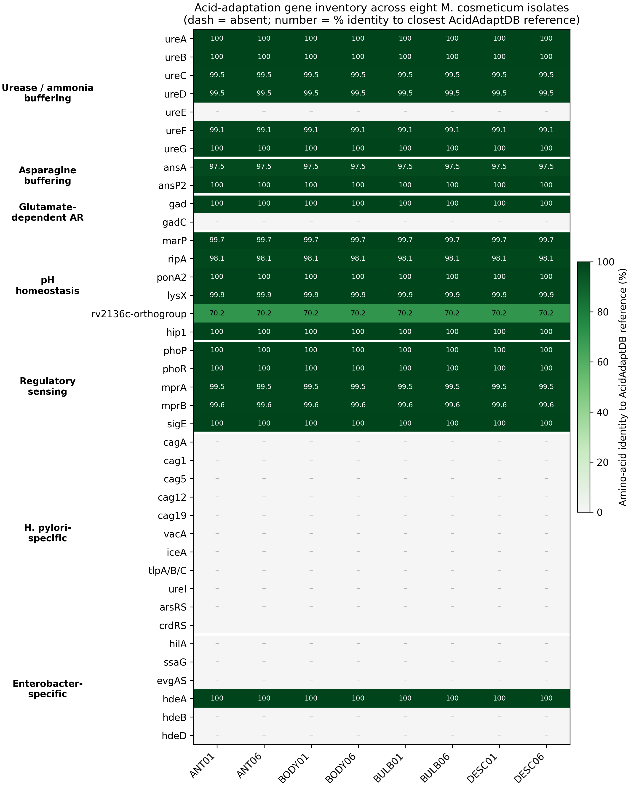

# Implementation Plan: In Silico Acid Adaptation and Gastric Acid Tolerance Repertoire — Rev. 2

> [!NOTE]
> **Rev. 2 (2026-08-30).** This revision scrutinizes the previous implementation plan against (i) the source-of-truth analysis repository `WhyAdr/m-cosmeticum-acid-adapt` (Acid-Adaptation docx, supplementary tables, both AcidAdaptDB manifests, and the pipeline scripts) and (ii) the primary literature (every DOI re-verified against Crossref/PubMed on 2026-08-30). The Results & Discussion insert was restructured into **five concise paragraphs** following the requested funnel: *H. pylori* + bacterial urease in general → urease in the *Mycobacterium* genus → other *Mycobacteriaceae* acid-adaptation mechanisms → the *M. cosmeticum* repertoire findings (present repertoire, then absent determinants/allele conservation). The new-reference count drops from 17 to **12** (the nine user-specified anchors, plus Clemens 1995 for the *M. tuberculosis* urease enzymology, plus Eddy 2011 and Cock 2009 for the Methods). All issues found are tabulated below; the diff blocks are self-contained and ready for execution.

## Audit Summary

### Issues Found and Corrected in This Revision

| # | Issue | Severity | Fix |
|---|-------|----------|-----|
| 1 | **Discussion did not follow the requested structure.** The previous draft wove the *M. cosmeticum* findings through paragraphs 2–3 (urease findings inside the "Mycobacterium urease" paragraph; mechanism identities inside the "other mechanisms" paragraph) and never presented the isolate repertoire as a unit of its own. | High | Restructured into five paragraphs: (1) *H. pylori* acid acclimation via the urease gene cluster + bacterial urease in general [Scott et al., 2002; Koper et al., 2004]; (2) the urease system in the *Mycobacterium* genus [Reyrat et al., 1995; Clemens et al., 1995]; (3) other *Mycobacteriaceae* acid-adaptation mechanisms [Rai et al., 2022; Laudouze et al., 2025; Gouzy et al., 2014; Rai et al., 2025; Vandal et al., 2009; Botella et al., 2017]; (4) the *M. cosmeticum* positive repertoire (Figure 4); (5) absent lineage-specific determinants, the *hdeA* exception, absolute allele conservation, and interpretation. |
| 2 | **Six reference entries carried incorrect metadata** (verified against Crossref/PubMed, 2026-08-30). Scott 2002: author list wrong (actual: Scott, Marcus, Weeks & Sachs — not "Scott, Weeks, Melchers & Sachs"). Koper 2004: author order wrong (Norton before Klotz). Botella 2017: fabricated middle authors ("Madar", "Schnappinger", "Bhatt"); actual co-authors are Lee, Song, Xu, Makinoshima, Glickman & Ehrt. Vandal entry conflated the 2008 *Nature Medicine* membrane-protein paper with the user-cited mutant paper (10.1128/JB.00932-08) and listed the wrong authors ("Pierini" belongs to the 2008 paper; the 2009 authors are Vandal, Roberts, Odaira, Schnappinger, Nathan & Ehrt) plus an awkward embedded note. Clemens 1995: wrong issue (177(**19**), not 177(20)) and wrong title tail ("host-**pathogen interaction**", not "host resistance"); its DOI did not resolve. Ryndak 2008: author list wrong (no Rodriguez; actual: Ryndak, Wang & Smith). | High | All retained entries rewritten from verified metadata. Vandal entry replaced by a single clean record for 10.1128/JB.00932-08; in-text citation "Vandal, Pierini, et al., 2009" → "Vandal et al., 2009". Clemens DOI corrected to 10.1128/JB.177.19.5644-5652.1995 (verified resolving). Ryndak dropped (see #3). |
| 3 | **Reference set exceeded the user-specified anchors** (17 new references vs the 9 requested) and contained one entry whose DOI does not resolve (He 2006, 10.1128/JB.188.7.2134-2143.2006 → HTTP 404). | Medium | Trimmed to 12 new references: the 9 user-specified anchors + Clemens 1995 (needed for the *M. tuberculosis* urease purification/nitrogen-acquisition claims) + Eddy 2011 and Cock 2009 (Methods tools). Dropped: Weeks 2000 (UreI is covered by the Scott 2002 review), Mobley 1995 (general-urease claims now rest on Koper 2004), Maloney 2009 (*lysX* acid susceptibility now attributed to the Vandal 2009 mutant set, which includes *lysX*), He 2006 and Ryndak 2008 (regulatory-tier claims attributed to the Rai 2022 / Laudouze 2025 reviews). Every remaining claim is still cited. |
| 4 | **Methods target arithmetic inconsistent.** The text claimed "38 target proteins" but itemized 44 gene symbols (*tlpA/tlpB/tlpC*, *arsR/arsS*, *crdR/crdS*, *evgA/evgS* listed individually), and described the database as "201 unique reference proteins … after de-duplication". The Master Results sheet tracks 39 rows = 38 target systems + the *rv2136c* refuted control; the database is 180 de-duplicated AcidAdaptDB proteins + 21 lineage-specific proteins = 201. | Medium | Re-itemized the seven categories using the panel's grouped notation (*tlpA/B/C*, *arsRS*, *crdRS*, *evgAS* each counted once; now 7+2+2+5+5+11+6 = 38), flagged *rv2136c* explicitly as a historical refuted control, and described the database composition precisely (180 + 21 = 201). |
| 5 | **Methods omitted the annotation-based screening stage** that the pipeline performs: regex synonym screening over gene symbols/product texts, KEGG orthology cross-references, neighbourhood analysis for operon structure, and cross-validation of annotation vs alignment evidence (all present in `similarity_search.py` and the Annotation Hits sheet). | Medium | Added the annotation-nomination stage ahead of the two-stage homology search, and stated that annotation-based and alignment-based evidence are cross-validated. |
| 6 | **Over-attribution to Reyrat et al. (1995).** The draft had Reyrat "establishing" the full locus organization ("*ureABC* followed by *ureFGD*"), but the paper reports the cloning/mapping of *ureABC* and the first allelic exchange (its abstract describes three ORFs); the H37Rv accessory-gene order is *ureF–ureG–ureD*. H37Rv locus verified via NCBI Gene: *ureA–ureB–ureC–ureF–ureG–ureD*, all + strand, 2,097,348–2,101,647 (~4.3 kb), no *ureE*. The phrase "first allelic exchange in a mycobacterium" also overstates the paper's own claim. | High | Reyrat is now cited only for the cloning/mapping of the locus and the first allelic exchange demonstrated in **slow-growing** mycobacteria. The six-gene *ureA–ureB–ureC–ureF–ureG–ureD* architecture is presented as the H37Rv reference organization (consistent with the AcidAdaptDB anchor manifest and NCBI Gene), and the correct gene order is used throughout. |
| 7 | **Genus-level distribution claim unsupported.** The draft (following the source docx) stated the urease core occurs in "*M. avium*", but the v0.3.3 panel contains no urease-module rows for *M. avium*. | Medium | Rewritten to the taxa actually documented: six-gene core in *M. bovis*, *M. marinum*, *M. ulcerans*, *Mycobacteroides abscessus*, *Mycolicibacterium canariasense*, *M. cosmeticum*, *M. fortuitum*, *M. smegmatis* (+ the H37Rv anchor), with standalone *ureE* recorded only for *M. canariasense*. |
| 8 | **Whole-proteome metric misstated.** "93.4–99.4% identity observed across whole-proteome pairwise comparisons" — the metric is the **fraction of exactly identical proteins** (computed relative to ANT01), not a percent identity. | Low | Rephrased as "only 93.4–99.4% of proteins are shared as exact matches in pairwise whole-proteome comparisons". |
| 9 | **Reference numbering violated first-appearance order.** Previous plan numbered discussion references 18–32 and tool references 33–34, but the Methods insertion (which cites Eddy and Cock) precedes the Results & Discussion insertion in the document. | Low | Renumbered 18–29 strictly by first appearance: 18 Eddy, 19 Cock (Methods); 20 Scott, 21 Koper, 22 Reyrat, 23 Clemens, 24 Rai 2022, 25 Laudouze, 26 Vandal, 27 Gouzy, 28 Rai 2025, 29 Botella (Discussion). |
| 10 | **Section heading** "Acid Adaptation to Gastric Acid and Acidic Microenvironments" was unwieldy and did not parallel the sibling results headings. | Low | Renamed `## Acid-Adaptation Gene Repertoire`, parallel to the Methods heading `## Acid-Adaptation Repertoire Profiling` and sibling headings such as `## Virulence Factor Profiling`. |

### Retained from the Previous Revision

- The three insertion regions and their anchors (re-verified against `main` of `WhyAdr/ra-mc-manu`, 153 lines): (A) Methods between lines 31 and 33; (B) Results & Discussion before `# References`; (C) References after line 152.
- The two-stage homology-search description (pyhmmer single-sequence pHMM → Smith–Waterman verification; presence thresholds ≥20% identity, ≥40% reference coverage) and the allele-conservation methodology — now matched exactly to `similarity_search.py` / `allele_variation.py`.
- Use of the already-committed `Figure1_Acid-Adaptation_Heatmap.png` as new Figure 4, with the descriptive bold-label reference style (`N. **Label**: Author …`).

---

## Exact Diff

### [MODIFY] [RA-MC-manuscript.md](https://github.com/WhyAdr/ra-mc-manu/blob/main/RA-MC-manuscript.md)

Three insertion regions: **(A)** Methods subsection between lines 31 and 33; **(B)** Results & Discussion section between line 130 and `# References` (line 133); **(C)** References appended after line 152 (reference 17, MAFFT).

---

#### (A) Methods — insert between line 31 and line 33

After the end of `### Plasmid and Mobilome Analysis` (line 31), before `## Comparative Pangenome Analysis` (line 33):

```diff
 Extrachromosomal replicons and mobile genetic elements (MGEs) were characterized using several tools. Contig circularity was initially determined during Trycycler consensus assembly [Wick et al., 2021], and contigs were reoriented using dnaapler (v1.3.0) [Bouras et al., 2024], which identified replication initiation (*repA*) and large terminase (*terL*) genes on non-chromosomal contigs. Replicon typing, relaxase classification, and mobility prediction were performed using MOB-suite (v3.1.9) `mob_recon` with `--run_overhang`, `--keep_tmp`, and `--debug` flags [Robertson & Nash, 2018]. As an independent confirmation of replicon identity, plasmid and virus/provirus classification was performed using geNomad (v1.12.0) `end-to-end` with default scoring thresholds (plasmid/virus score ≥ 0.7) against the geNomad database [Camargo et al., 2024]. Insertion sequences (ISs) were identified from the MOB-suite MGE report.
 
+## Acid-Adaptation Repertoire Profiling
+
+The acid-adaptation gene repertoire of the eight *M. cosmeticum* isolates was evaluated against a curated reference framework combining the AcidAdaptDB *Mycobacteriaceae* anchor manifest (v0.1) and representative panel (v0.3.3), supplemented with lineage-specific control sequences of *Helicobacter pylori* and enterobacterial origin. The combined query set comprised 38 target systems spanning seven functional categories: (i) urease and ammonia buffering (*ureA*, *ureB*, *ureC*, *ureD*, *ureE*, *ureF*, *ureG*); (ii) asparagine buffering (*ansA*, *ansP2*); (iii) glutamate-dependent acid resistance (*gad*, *gadC*); (iv) cell-envelope and proteolytic pH homeostasis (*marP*, *ripA*, *ponA2*, *lysX*, *hip1*); (v) regulatory sensing (*phoP*, *phoR*, *mprA*, *mprB*, *sigE*); (vi) *H. pylori*-specific gastric determinants (*cagA*, *cag1*, *cag5*, *cag12*, *cag19*, *vacA*, *iceA*, *ureI*, the chemotaxis transducers *tlpA*/*tlpB*/*tlpC*, and the *arsRS* and *crdRS* two-component systems); and (vii) enterobacterial acid-fitness markers (*hilA*, *ssaG*, *evgAS*, *hdeA*, *hdeB*, *hdeD*). The *rv2136c* orthogroup was retained strictly as a historical, refuted control. After de-duplication, the 180 unique AcidAdaptDB reference proteins were combined with 21 lineage-specific reference proteins retrieved from NCBI RefSeq, yielding a 201-protein search database.
+
+Bakta-annotated GenBank records (.gbff) containing a total of 50,998 predicted coding sequences were iterated programmatically using the genbank-parser package (v0.6.0). Candidate loci were first nominated by screening the pooled coding-sequence inventory against a curated dictionary of regular-expression patterns covering gene symbols and product descriptions for all targets, with KEGG orthology identifiers carried in feature notes (e.g., K03188 for *ureF*) used as auxiliary evidence; genomic neighbourhoods of key loci were inspected to resolve operon structures. Sequence homology detection then followed a two-stage strategy. In the first stage, a single-sequence profile hidden Markov model was built for each reference protein and searched against the digitized isolate proteomes using pyhmmer (HMMER3 architecture) [Eddy, 2011]. In the second stage, candidate pairs passing a bitscore floor of 20.0 were verified by Smith-Waterman local alignment under the BLOSUM62 substitution matrix (gap opening −11, extension −1) implemented in Biopython [Cock et al., 2009]. A locus was scored as present when the best alignment met minimum thresholds of ≥20% amino acid identity over ≥40% of the reference length; annotation-based and alignment-based evidence were cross-validated, with discrepancies resolved in favour of the alignment. Intra-species allelic conservation was quantified by extracting the best-matching isolate protein for each verified locus and computing global pairwise sequence identities across all eight isolates; as a genome-wide baseline, whole-proteome similarity was estimated by exact-match partitioning of all translated coding sequences.
+
 ## Comparative Pangenome Analysis
```

---

#### (B) Results and Discussion — insert between line 130 and line 133

After the final pangenome paragraph (line 130), in place of the two blank lines (131–132), before `# References` (line 133):

```diff
 In contrast, the eight isolates generated in this study formed a highly conserved gene-content group: 6,299 of 6,397 families (98.5%) were shared by all eight, leaving only 98 variable families, and pairwise gene-content Jaccard similarities ranged from approximately 0.988 to 0.9995. A further 472 families were shared by the eight study isolates but absent from the public genomes, with many occurring in contiguous blocks, including 201 families on the large plasmid-like contig of ANT01 and homologous regions in the other study isolates. Strict cleaning also removed all 190 CDSs from the distinct BULB06 plasmid-like contig despite its coherent replication, conjugation, Type VII secretion, mercury-resistance, and mobile-element annotations. Thus, the strict pangenome matrix captures the close relatedness of the study isolates but likely underestimates their mobile accessory gene content.
 
+## Acid-Adaptation Gene Repertoire
+
+Gastric acid, whose luminal pH can fall to between 1 and 2, kills most vegetative bacteria within minutes, yet *Helicobacter pylori* colonises the gastric mucosa of roughly half of humanity — a success attributable in large part to its urease gene cluster system [Scott et al., 2002]. Urease hydrolyses host-derived urea into ammonia and carbon dioxide, and in *H. pylori* this chemistry operates as a programmable periplasmic buffer: the ammonia released neutralises protons diffusing inward from gastric juice and stabilises the periplasm near pH 6.1 while the cytoplasm is held close to neutrality, allowing growth rather than mere survival under continuous acid challenge — a strategy termed acid acclimation [Scott et al., 2002]. The machinery couples the structural subunits UreA, UreB and UreC to nickel-inserting accessory maturation proteins and to the proton-gated urea channel UreI, which matches urea influx to the prevailing acid load [Scott et al., 2002]. Urease is nonetheless no gastric invention: homologous, nickel-dependent operons are widely distributed across soil, freshwater and host-associated prokaryotes, in which they function primarily as engines of organic nitrogen scavenging, as illustrated by ammonia-oxidising bacteria that retain urease operons — sometimes in multiple copies — in order to exploit urea as a nitrogen substrate in oligotrophic habitats [Koper et al., 2004].
+
+Whether the *Mycobacterium* lineage participates in the same chemistry was settled early at the molecular level. Reyrat and colleagues cloned and mapped the *Mycobacterium tuberculosis* urease locus and exploited disruption of *ureC* to achieve the first allelic exchange demonstrated in the slow-growing mycobacteria [Reyrat et al., 1995]; in the same year, Clemens and co-workers purified the enzyme, showed that its expression rises roughly ten-fold under nitrogen deprivation — consistent with a role in nitrogen acquisition — and proposed the locus as a potentially critical determinant of host-pathogen interaction [Clemens et al., 1995]. In the H37Rv reference genome this locus is a contiguous six-gene cluster, *ureA*-*ureB*-*ureC* followed by the accessory maturation genes *ureF*-*ureG*-*ureD*, and no *ureE* homolog exists anywhere in the reference annotation. Sampling across the AcidAdaptDB representative panel indicates that this ureE-less architecture is the family-wide condition rather than the exception: the six-gene core recurs in the slow-growing *Mycobacterium bovis*, *M. marinum* and *M. ulcerans*, as well as in the rapid-growing *Mycobacteroides abscessus* and in *Mycolicibacterium canariasense*, *M. fortuitum* and *M. smegmatis*, with *M. canariasense* remaining the only panel taxon in which a standalone *ureE* is recorded at all.
+
+For the *Mycobacteriaceae*, however, the acid problem is phagosomal rather than gastric: *M. tuberculosis* must sustain cytoplasmic pH homeostasis within macrophage phagosomes that acidify to approximately pH 4.5–5.0 following phagosome–lysosome fusion, and two decades of genetic and biochemical work, synthesised in recent reviews, have delineated a multi-tiered acid-resistance programme that extends well beyond urease [Rai et al., 2022; Laudouze et al., 2025]. A second tier is metabolic alkalinisation through amino-acid catabolism: *M. tuberculosis* imports asparagine through the permease AnsP2 and deamidates it via the cytoplasmic asparaginase AnsA, releasing ammonia that counters intracellular acidification, and both factors are required for survival in acidified macrophages [Gouzy et al., 2014]. The glutamate branch operates analogously, with glutamate decarboxylase consuming a cytoplasmic proton as it converts glutamate to γ-aminobutyrate; the mycobacterial Gad enzyme has been shown to confer acid tolerance and to enhance survival within macrophages [Rai et al., 2025]. A third tier safeguards the cell envelope: transposon mutants of *M. tuberculosis* hypersusceptible to pH 4.5 carry disruptions in envelope-integrity genes, among them *ponA2* and *lysX*, and share cross-hypersusceptibility to cell-wall, oxidative and host stresses [Vandal et al., 2009], while the membrane-embedded serine protease MarP activates the peptidoglycan hydrolase RipA to couple acid-induced envelope damage to controlled repair [Botella et al., 2017]. These tiers are orchestrated by dedicated regulatory circuitry — two-component systems and extracytoplasmic-function sigma factors that reprogramme transcription as the pH falls [Rai et al., 2022; Laudouze et al., 2025].
+
+Set against this framework, the eight *M. cosmeticum* isolates emerge as natural carriers of essentially the complete mycobacterial acid-adaptation programme (Figure 4). Every genome harbours an intact urease cluster (*ureA*-*ureB*-*ureC*-*ureF*-*ureG*-*ureD*; 99.1–100.0% identity to panel references) that consistently lacks *ureE*, reproducing the H37Rv architecture exactly, and the cluster is embedded in a broader urea and nickel economy comprising a dedicated five-gene ATP-binding cassette urea transporter (*urtABCDE*), an ATP-dependent urea-amidolyase route that provides a nickel-independent alternative for urea dissimilation — a strategic redundancy the gastric pathogen lacks — and *nikD*-*nikE*/*nikQ* import loci together with the hydrogenase-maturation GTPase HypB supporting nickel supply. Each additional tier is likewise fully represented: the asparagine module is duplicated (the canonical *ansA* at 97.5% identity alongside a diverged second asparaginase paralogue, and the permease *ansP2* at 100.0%); a standalone *gad* (100.0%) operates without a GadC-type antiporter; the envelope determinants *marP* (99.7%), *ripA* (98.1%), *ponA2* (100.0%), *lysX* (99.9%) and *hip1* (100.0%) are each present as single conserved loci; and the regulatory systems *phoPR*, *mprAB* and *sigE* (99.5–100.0%) are complete. In total, 20 of the 22 AcidAdaptDB positive targets were recovered, the only exceptions being *ureE* and *gadC* — precisely the two loci documented as absent from the H37Rv anchor annotation — while the historical *rv2136c* orthogroup, retained strictly as a refuted control, was detectable at 70.2% identity and is reported without functional inference.
+
+The negative space of the survey is equally informative. None of the *H. pylori* determinants of gastric life — the *cag* pathogenicity island with its CagA effector, the vacuolating cytotoxin *vacA*, the acid-gated urea channel *ureI*, the chemotaxis transducers *tlpA*/*tlpB*/*tlpC* or the ArsRS and CrdRS two-component systems — nor the enterobacterial markers *hilA*, *ssaG*, *evgAS*, *hdeB* and *hdeD* has a significant counterpart in any of the eight genomes, indicating that the two lineages arrived at acid resistance by different evolutionary routes. The sole cross-lineage signal was an *hdeA*-family acid-stress chaperone (a 91-amino-acid protein, 100.0% identical to the conserved *Mycolicibacterium* sequence WP_024450767.1) present in every isolate as an isolated locus lacking *hdeB*, *hdeD* and regulatory partners, and sharing only marginal local similarity (36.1% over 36 residues) with the *Escherichia coli* chaperone — best interpreted as a distant relative or functional analogue whose behaviour at low pH remains a concrete, testable hypothesis. Most strikingly, allele-level conservation was absolute: each of the 20 recovered AcidAdaptDB targets, together with *hdeA*, was represented by a single invariant allele (100.0% inter-isolate amino-acid identity), against a background in which only 93.4–99.4% of proteins are shared as exact matches in pairwise whole-proteome comparisons. This uniformity, consistent with strong purifying selection, marks the acid-adaptation module as a routinely deployed — and effectively locked — component of the species' biology, a rational investment for an environmental rapid grower that must transit acidic skin, wound, water and intracellular microenvironments.
+
+**Figure 4.** Heatmap of predicted acid-adaptation and acid-tolerance determinants across the eight *Mycolicibacterium cosmeticum* isolates, constructed from the AcidAdaptDB reference framework and lineage-specific control markers. Rows represent individual target loci grouped by the seven functional categories (the *rv2136c* orthogroup is shown as a historical, refuted control); columns represent the eight genome assemblies. Cell values indicate percentage amino acid identity to the matched reference homolog; dashes denote absence below the significance thresholds (≥20% identity, ≥40% reference coverage).
+
+
+
 # References
```

> The trailing context line ` # References` above is the existing heading; only the `+` lines are inserted.

---

#### (C) References — append after line 152 (reference 17, MAFFT)

```diff
 17. **MAFFT**: Katoh, K., & Standley, D. M. (2013). MAFFT multiple sequence alignment software version 7: improvements in performance and usability. *Molecular Biology and Evolution*, 30(4), 772–780. https://doi.org/10.1093/molbev/mst010
+18. **HMMER3**: Eddy, S. R. (2011). Accelerated profile HMM searches. *PLOS Computational Biology*, 7(10), e1002195. https://doi.org/10.1371/journal.pcbi.1002195
+19. **Biopython**: Cock, P. J. A., Antao, T., Chang, J. T., Chapman, B. A., Cox, C. J., Dalke, I., Friedberg, I., Hamelryck, T., Kauff, F., Wilczynski, B., & de Hoon, M. J. L. (2009). Biopython: freely available Python tools for computational molecular biology and bioinformatics. *Bioinformatics*, 25(11), 1422–1423. https://doi.org/10.1093/bioinformatics/btp163
+20. **H. pylori urease system**: Scott, D. R., Marcus, E. A., Weeks, D. L., & Sachs, G. (2002). Mechanisms of acid resistance due to the urease system of *Helicobacter pylori*. *Gastroenterology*, 123(1), 187–195. https://doi.org/10.1053/gast.2002.34218
+21. **Urease in ammonia oxidizers**: Koper, T. E., El-Sheikh, A. F., Norton, J. M., & Klotz, M. G. (2004). Urease-encoding genes in ammonia-oxidizing bacteria. *Applied and Environmental Microbiology*, 70(4), 2342–2348. https://doi.org/10.1128/AEM.70.4.2342-2348.2004
+22. **M. tuberculosis urease locus**: Reyrat, J.-M., Berthet, F.-X., & Gicquel, B. (1995). The urease locus of *Mycobacterium tuberculosis* and its utilization for the demonstration of allelic exchange in *Mycobacterium bovis* bacillus Calmette-Guérin. *Proceedings of the National Academy of Sciences USA*, 92(19), 8768–8772. https://doi.org/10.1073/pnas.92.19.8768
+23. **M. tuberculosis urease characterization**: Clemens, D. L., Lee, B.-Y., & Horwitz, M. A. (1995). Purification, characterization, and genetic analysis of *Mycobacterium tuberculosis* urease, a potentially critical determinant of host-pathogen interaction. *Journal of Bacteriology*, 177(19), 5644–5652. https://doi.org/10.1128/JB.177.19.5644-5652.1995
+24. **Mycobacterial acid response**: Rai, R., Singh, V., Mathew, B. J., Singh, A. K., & Chaurasiya, S. K. (2022). Mycobacterial response to an acidic environment: protective mechanisms. *Pathogens and Disease*, 80(1), ftac032. https://doi.org/10.1093/femspd/ftac032
+25. **Mtb pH homeostasis**: Laudouze, J., Canaan, S., Gouzy, A., & Santucci, P. (2025). Unraveling *Mycobacterium tuberculosis* acid resistance and pH homeostasis mechanisms. *FEBS Letters*, 599(12), 1634–1648. https://doi.org/10.1002/1873-3468.70023
+26. **Acid-susceptible mutants**: Vandal, O. H., Roberts, J. A., Odaira, T., Schnappinger, D., Nathan, C. F., & Ehrt, S. (2009). Acid-susceptible mutants of *Mycobacterium tuberculosis* share hypersusceptibility to cell wall and oxidative stress and to the host environment. *Journal of Bacteriology*, 191(2), 625–631. https://doi.org/10.1128/JB.00932-08
+27. **Asparagine acid resistance**: Gouzy, A., Larrouy-Maumus, G., Bottai, D., Levillain, F., Dumas, A., Wallach, J. B., Caire-Brandli, I., de Chastellier, C., Wu, T.-D., Poincloux, R., Brosch, R., Guerquin-Kern, J.-L., Schnappinger, D., Sório de Carvalho, L. P., Poquet, Y., & Neyrolles, O. (2014). *Mycobacterium tuberculosis* exploits asparagine to assimilate nitrogen and resist acid stress during infection. *PLoS Pathogens*, 10(2), e1003928. https://doi.org/10.1371/journal.ppat.1003928
+28. **Glutamate decarboxylase**: Rai, R., Mathew, B. J., Chourasia, R., Singh, A. K., & Chaurasiya, S. K. (2025). Glutamate decarboxylase confers acid tolerance and enhances survival of mycobacteria within macrophages. *Journal of Biological Chemistry*, 301(4), 108338. https://doi.org/10.1016/j.jbc.2025.108338
+29. **MarP-RipA acid repair**: Botella, H., Vaubourgeix, J., Lee, M.-H., Song, N., Xu, W., Makinoshima, H., Glickman, M. S., & Ehrt, S. (2017). *Mycobacterium tuberculosis* protease MarP activates a peptidoglycan hydrolase during acid stress. *The EMBO Journal*, 36(4), 536–548. https://doi.org/10.15252/embj.201695028
```

---

## Verification Plan

### Pre-Execution Checks

1. Confirm `Figure1_Acid-Adaptation_Heatmap.png` is present in the `ra-mc-manu` repository root (confirmed at audit time; blob `8ddde35`). Optional: rename to `Figure4_Acid-Adaptation_Heatmap.png` for numbering consistency — if renamed, update the image reference in diff (B) accordingly.
2. Verify line numbers have not shifted since this audit (manuscript at `main`, 153 lines): (A) between line 31 (end of `### Plasmid and Mobilome Analysis`) and line 33 (`## Comparative Pangenome Analysis`); (B) between line 130 (final pangenome paragraph) and line 133 (`# References`); (C) after line 152 (reference 17, MAFFT).
3. Confirm no other pending edits to the manuscript would conflict with these insertions.

### Post-Execution Checks

1. **Render check:** the new sections use `##` headings correctly nested under `# Materials and Methods` and `# Results and Discussion`; Figure 4 embeds correctly; italics render for all species names and gene symbols; no double blank lines remain at the insertion seams.
2. **Spot-check every identity value** in the discussion against the `Master Results` sheet of `Acid-Adaptation_Supplementary_Tables.xlsx` (`m-cosmeticum-acid-adapt` repo): *ureA* 100.0 / *ureB* 100.0 / *ureC* 99.5 / *ureD* 99.5 / *ureF* 99.1 / *ureG* 100.0 (hence cluster range 99.1–100.0); *ansA* 97.5; *ansP2* 100.0; *gad* 100.0; *marP* 99.7; *ripA* 98.1; *ponA2* 100.0; *lysX* 99.9; *hip1* 100.0; *rv2136c* 70.2; *phoP* 100.0; *phoR* 100.0; *mprA* 99.5; *mprB* 99.6; *sigE* 100.0; *hdeA* 100.0 (WP_024450767.1). All allele counts = 1.
3. **Numeric claims:** 38 target systems + the *rv2136c* control = 39 tracked rows; 20 of 22 AcidAdaptDB positive targets recovered (absent: *ureE*, *gadC*); 180 + 21 = 201 reference proteins; 50,998 CDSs; whole-proteome identical fraction 93.4–99.4% (computed relative to ANT01).
4. **Citation mapping:** Methods → [Eddy, 2011] = ref 18, [Cock et al., 2009] = ref 19; Discussion → [Scott et al., 2002] = 20, [Koper et al., 2004] = 21, [Reyrat et al., 1995] = 22, [Clemens et al., 1995] = 23, [Rai et al., 2022] = 24, [Laudouze et al., 2025] = 25, [Vandal et al., 2009] = 26, [Gouzy et al., 2014] = 27, [Rai et al., 2025] = 28, [Botella et al., 2017] = 29. No orphaned references; numbering 18–29 follows first appearance in the document.
5. **Heading check:** `## Acid-Adaptation Gene Repertoire` does not collide with any existing heading; it follows `## Comparative Pangenome Analysis` as the final Results & Discussion subsection.

### Reference Verification Record (Crossref/PubMed, 2026-08-30)

All 12 new references were verified against Crossref and PubMed: titles, author lists, journals, volumes, issues, pages and DOIs all cross-checked. The previously erroneous Scott/Koper/Botella/Vandal/Ryndak author lists and the Clemens issue number and DOI were corrected (audit items 2–3). Every DOI in references 18–29 resolves, including the corrected Clemens DOI (10.1128/JB.177.19.5644-5652.1995). Dropped references (Weeks 2000, Mobley 1995, Maloney 2009, He 2006, Ryndak 2008) are no longer cited anywhere in the inserted text and therefore require no entries.
